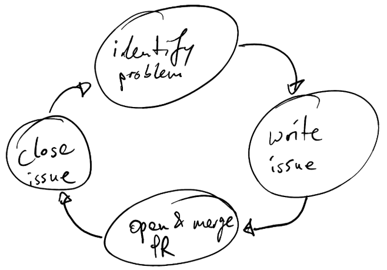

# Git handbook

Git is an essential tool for version control in software development.
This guide will help you navigate Git effectively and follow best practices.

If you're new to Git, we recommend watching
[this comprehensive video series](https://www.youtube.com/watch?v=rH3zE7VlIMs)
for a solid foundation.

## Our git workflow

There are very few reasons where this workflow is not adequate:

**When you identify a problem that you want to resolve,
create an issue first. Then you create a PR that addresses this issue.
After the PR is merged, you close the issue.
Repeat.**

This means that very rarely would you ever create large PRs.
The **ideal PR is short and concise**.

## Best practices for Pull Requests (PRs)

### Before creating a PR

1. **Keep your branch updated**
   - Regularly rebase your branch with the master using `git rebase master`.
     - Alternatively, you can create a new commit
       in your git history with `git merge master`.
     - Ensure you have the latest master branch locally before rebasing or merging.
   - Resolve any merge conflicts before requesting reviews.

2. **Code quality**
   - Run pre-commit hooks before committing.
     Ensure all hooks pass before requesting reviews

### Creating and managing PRs

1. **PR status**
   - Don't wait until your code change is finished.
     Open a `draft PR` immediately after your first commit.
   - Mark as "Ready for Review" when the PR is complete
     and you want to formally ask for a peer review.

2. **PR description**
   - Always include a clear, well-formatted description
   - Avoid typos and formatting issues
   - Keep PRs manageable in size (avoid large changes like 50+ files)

3. **Commit messages**
   - Use descriptive commit messages
   - Consider using gitmojis for visual context (e.g., :bug:
     for bug fixes) - see [gitmoji.dev](https://gitmoji.dev/)
   - Squash minor commits into more meaningful ones
   - Set "Squash and merge" as the default merge option

### Handling Reviews

1. **Responding to Comments**
   - Address all review comments
   - Click "Resolve conversation" after addressing a comment
   - Either resolve or provide clear responses to all comments

2. **Issue Management**
   - Close related issues after merging PRs
   - Reference the resolving PR in the issue closure comment

## Tips for Efficient Git Usage

- Keep branches focused on single features or fixes
- Make atomic commits (one logical change per commit)
- Handle merge conflicts promptly

## Helpful git commands

Shown below is a subset of git commands.
Feel free to dive deeper.
Just remember you're still considered a solid English speaker
even if you don't know what 'transmogrify' means.

- `git init`: Initializes a new Git repository in the current directory.
- `git clone <git_url>`: Clone an existing repo to a local location.
- `git remote add origin <git_url>`: Adds a remote repository
  called "origin" to the local repository.
- `git status`: Displays the status of the repository, including any changes or conflicts.
- `git log`: Displays a log of all commits made in the repository.
- `git branch`: Show all existing branches.
- `git checkout -b <branch_name>`: Create a new branch and switch to it.
- `git checkout <branch_name>`: Switches to an existing branch.
  (If switching to another branch is impossible due to
  existing changes you haven't merged yet, type in `git stash` first.)
- `git add <file>`: Mark a file as "part of the next commit".
  (`git add .` marks all files in the current directory & subdirectories)
- `git stash`: Save uncommitted stages into temporary storage & remove them locally.
  (Use `git stash pop` to load the stages from temporary storage.)
- `git commit -m "<message>"`: Commits changes with a meaningful commit message.
  (For longer commit messages just write `git commit`.)
- `git rebase master`: Load the most recent changes from master into your branch.
- `git rebase -i HEAD~<number_of_commits>`: interact with historical commits.
  Use this to squash minor/irrelevant commits by marking
  to-be-squashed commits with "s".
- `git push origin <branch_name>`: Pushes changes to the remote repository origin.
- `git pull origin`: Fetches and merges changes from the remote repository origin.
- `git reset --soft HEAD^`: revert the last commit
  and keep the changes in an uncommited stage.
  (Use `git reset --hard HEAD^` to revert the last commit and delete all changes.)
