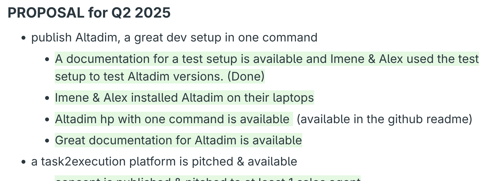

# Workflow handbook

Even a team of superstars benefits from great collaboration.
This document outlines the ways our team of superstars collaborates.
We came up with this list through trial & error. It works for us.
If you think we can improve, let us know.

The general philosophy behind our workflow is very simple:
maintain *high speed* for a *very long time*.

## Asynchronous weekly updates

Every Monday we share a reflection of our last week
and a plan for the coming week with the full team.
Everybody is invited to comment.

We do this to strengthen our relationships among each other
and to make fast progress.

- Writing down your thoughts helps you think things through.
  Hopefully, every now and then this will help you avoid hours of
  idle "exploration" because you "forgot" to think things through initially.
- If there is no relevant update for weeks,
  the group will notice. They will tell you.

## Weekly meeting

We currently do a weekly 60 minutes meeting. That meeting helps us
discuss progress and stay aligned.

## Track To Dos as Github Issues

We are a technology company. Our work revolves around git repositories.
To keep track of relevant tasks we use Github Issues. The most important
tasks are flagged as `prio1`.

When you don't know what to do and struggle to come up with a clear answer,
pick one of the open issues. If you don't know which one, just ask somebody
who likely knows.

## Set quarterly OKRs

Objectives and Key Results help us stay aligned on the bigger picture.
We regularly review these OKRs and update them if necessary.

## Factory-reset

We haven't implemented this yet. But going forward, we'll do a factory-reset
of all our hardware once a year. This ensures that our setups are easily recoverable.
